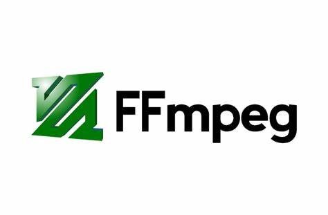

# BlinksMedia - Asynchronous Video Processing Architecture with RabbitMQ

[](https://vercel.com/your-vercel-project-link)
[](https://raleway.com/your-raleway-project-link)

**BlinksMedia** is a sophisticated short-form video application designed to showcase quick, engaging content. This project demonstrates my expertise in modern web development technologies, including React.js for the frontend and Node.js/Express for the backend.


## Project Overview

In this project, I've implemented an asynchronous video processing architecture to efficiently handle video uploads and processing tasks. The architecture is designed to offload the heavy lifting of video processing from the main application thread, ensuring that users do not have to wait synchronously for the process to complete. This approach enhances the user experience by providing immediate feedback while the processing happens in the background.

## Architecture Details


### 1. Video Upload
- When a user uploads a video, the file is first uploaded to a cloud storage service. In this project, we are using `Cloudinary Storage` to store the uploaded videos, but any cloud storage service can be integrated.

- Once the upload is complete, a processing task is created in the database. This task contains all the necessary information for processing, such as the video URL, status, and any specific processing instructions.

### 2. Task Queue with RabbitMQ
- After the processing task is created, its ID is sent to a `RabbitMQ` queue. This queue acts as a message broker, decoupling the task creation from the processing and allowing for asynchronous handling of the workload.
- The user interface is updated with a message indicating that the video is being processed and that it may take a few minutes.

### 3. Node.js Worker
- A Node.js worker is set up to continuously poll the RabbitMQ queue for new tasks. The worker acts as a dedicated processor, picking up tasks as they become available.
- Upon receiving a task, the worker retrieves the necessary information from the database and begins processing the video using FFmpeg. FFmpeg is a powerful tool used for video conversion, normalization, and creating adaptive bitrate streaming formats.
- Once the processing is complete, the resulting files are stored back in the cloud storage.

### 4. Task Completion
- After the video processing is finished, the task's status is updated in the database. This status update triggers the user interface to reflect the completion of the processing, notifying the user that the video is now available for viewing or further actions.


### Benefits of this Architecture

- **Asynchronous Processing:** Users are not required to wait synchronously for video processing, enhancing the overall user experience.
- **Scalability:** The use of RabbitMQ and a dedicated worker allows the system to handle multiple video processing tasks concurrently, making it highly scalable.
- **Decoupling:** The task queue decouples the upload process from the processing logic, resulting in a more modular and maintainable codebase.
- **Robustness:** By leveraging cloud storage and FFmpeg, the architecture ensures that video processing is both reliable and capable of handling various video formats and requirements.

## Technology Stack


<p align="center">
  
  
  
  
  
  
</p>


- **Google Cloud Storage:** For storing uploaded and processed video files.
- **RabbitMQ:** For managing the task queue and ensuring asynchronous processing.
- **Node.js:** As the backend runtime environment, including the worker process.
- **FFmpeg:** For video processing tasks such as normalization and adaptive bitrate streaming.
<br/>
<br/>
- **MongoDB**: Using MongoDB for a flexible and scalable database solution.
- **Redis**: Implementing Redis for efficient caching and real-time data processing.
- **React.js**: Leveraging React’s component-based architecture for a responsive and interactive user interface.

## Getting Started

### Prerequisites

- Node.js and npm installed on your machine.
- Git installed on your machine.

### Clone the Repository

```bash
git clone https://github.com/theritikchoure/blinksmedia.git
cd blinksmedia
```

### Setup and Installation

#### Client (React.js)

```
cd client
npm install
npm start
```

#### Server (Node.js/Express)

```
cd server
npm install
npm start
```

### Configuration

- **Environment Variables:** Configure necessary environment variables for both the frontend and backend.
- **Database:** Set up MongoDB and Redis instances as per the configuration files.

## Contact

Feel free to reach out to me for collaboration or job opportunities:

LinkedIn: [@ritikchourasiya](https://linkedin.com/in/ritikchourasiya)

GitHub: [@theritikchoure](https://github.com/theritikchoure)

Email: [ritvikchoure65@gmail.com](mailto://ritvikchoure65@gmail.com)
